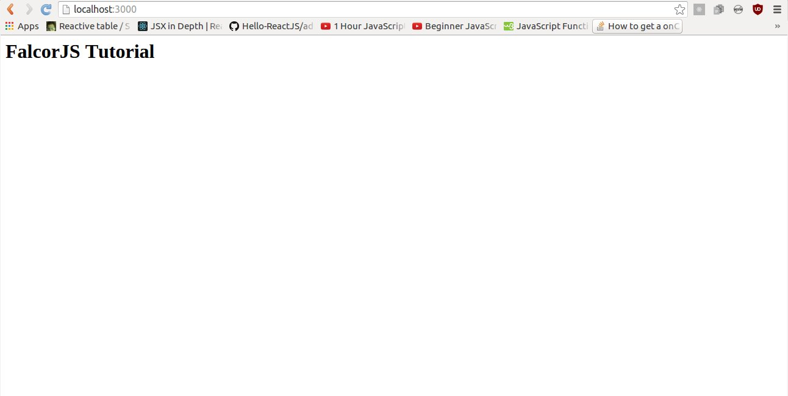
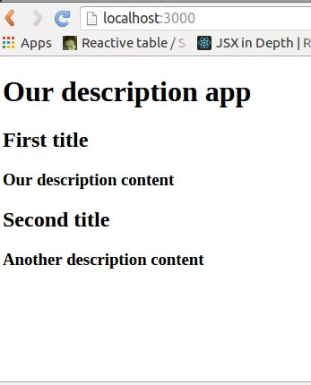
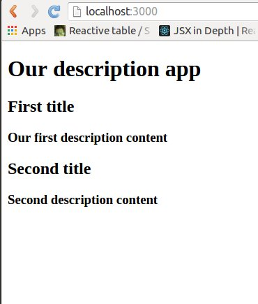

## FalcorJS tutorial

To start you need to have installed MongoDB on your computer. We will be using Robomongo GUI during this tutorial too.

First let's create our project directory called falcor-tutorial, then add data.js file:

```
mkdir falcor-tutorial
cd falcor-tutorial
touch data.js
```

Inside the data.js file we need to insert some data in JSON format:

```
[
    {
        id: "987654",
        title: "First text",
        content: "Hello World!"
    },
    {
        id: "123456",
        title: "Second text",
        content: "Nice to meet you!"
    }
]
```


We need to run MongoDB in background ( I am assuming that it has been already installed), just type in the terminal:

```
mongod
```

Then open Robomongo client.

Another step is to import our data object we created earlier to our MongoDB:

```
mongoimport --db local --collection descriptions --jsonArray data.js --host=127.0.0.1
```

After executing this command we can view through Robomongo that data was succesfully imported :


### Now let's do server setup with NodeJS and Express.js

First step is to initialze NPM project in our directory and create a server.js and index.js files in server directory:
```
npm init --yes

mkdir server
cd server
touch index.js
touch server.js
```

Then install all necessary dependencies:
```
npm i express@4.13.4 babel@4.7.16 babel-register@6.5.2 cors@2.7.1 body-parser@1.15.0 --save
```

The index.js file:
```
require("babel/register");
require('./server');
```


And the server.js file with simple string viewed on the app screen should look like this :
```
import http from 'http';
import express from 'express';
import cors from 'cors';
import bodyParser from 'body-parser';

var app = express();
app.server = http.createServer(app);

// CORS - 3rd party middleware
app.use(cors());

// This is required by falcor-express middleware to work correctly with falcor-browser
app.use(bodyParser.json({extended: false}));

app.get('/', (req, res) => res.send('FalcorJS Tutorial'));

app.server.listen(process.env.PORT || 3000);
console.log(`Started on port ${app.server.address().port}`);

export default app;

```
Next run this command in terminal:
```
node server/index.js 
```
After running this through node js, 'FalcorJS Tutorial' string that we are sending should show on the screen:



## Adding Redux

First let's create reducer for adding description.

```
mkdir src
cd src
mkdir reducers
cd reducers
touch BookDescriptionReducer.js
```

Our reducer will look like this:

```
const defaultDescriptions = {
	"987654": {
		descriptionTitle: "First title",
		descriptionContent: "Our description content"
	},
	"123456": {
		descriptionTitle: "Second title",
		descriptionContent: "Another description content"
	}
};

const descriptionReducer = (state = defaultDescriptions, action) => {
	switch (action.type) {
		case 'RETURN_ALL_DESCRIPTIONS':
			return Object.assign({}, state);
		default:
			return state;
	}
}

export default descriptionReducer
```

Later we will need webpack, so enter your main directory and create dist directory with index.html file inside:

```
mkdir dist
cd dist
touch index.html
```

Insert to index.html following code:

```
<!doctype html>
<html lang="en">
<head>
  <title>Tutorial App</title>
  <meta charset="utf-8">

</head>
<body>
  <div id="tutorial-app-root"></div>
  <script src="app.js"></script>
</body>
</html>
```

Install Webpack, React, Redux and other important dependencies (you may need sudo root's access for it):

```
npm i --save webpack@1.12.14 webpack-dev-server@1.14.1

npm i --save react@0.14.7 react-dom@0.14.7 react-redux@4.4.0 redux@3.3.1

npm i --save-dev babel-core@6.6.5 babel-polyfill@6.6.1 babel-loader@6.2.4 babel-preset-es2015@6.6.0 babel-preset-react@6.5.0 babel-preset-stage-0
```


...then in the main directory create file:
```
touch webpack.config.js
```

And enter webpack's configuration:
```
module.exports = {
    entry: ['babel-polyfill', './src/App.js'],
    output: {
        path: './dist',
        filename: 'app.js',
        publicPath: '/'
    },
    devServer: {
        inline: true,
        port: 3000,
        contentBase: './dist'
    },
    module: {
        loaders: [
            {
                test: /\.js$/,
                exclude: /(node_modules|bower_components)/,
                loader: 'babel',
                query: {
                    presets: ['es2015', 'stage-0', 'react']
                }
            }
        ]
    }
}
```
We also need to update our package.json file (add scripts):

```
  "scripts": {
    "dev": "webpack-dev-server"
  },
```

Next let's create App.js in src/App.js:

```
import React from 'react'
import { render } from 'react-dom'
import { Provider } from 'react-redux'
import { createStore } from 'redux'
import BookDescriptionReducer from './reducers/BookDescriptionReducer'
import BookDescriptionApp from './layouts/BookDescriptionApp'

let store = createStore(BookDescriptionReducer)

render(
    <Provider store={store}>
        <BookDescriptionApp />
    </Provider>,
    document.getElementById('tutorial-app-root')
);
```

Now we need to create the main view of our app in 'src' directory.

```
mkdir layouts
cd layouts
touch BookDescriptionApp.js
```

With following content:

```
import React from 'react';
import { connect } from 'react-redux';

const mapStateToProps = (state) => ({
  ...state
});

const mapDispatchToProps = (dispatch) => ({
});

class BookDescriptionApp extends React.Component {
  constructor(props) {
    super(props);
  }
  render () {
    console.log(this.props);    
    return (
      <div>
          Our description app
      </div>
    );
  }
}

export default connect(mapStateToProps, mapDispatchToProps)(BookDescriptionApp);
```

### Finishing our first static description app

We need to change the React's render function
as following (in src/views/DescriptionApp.js):
```
  render () {
    let descriptionsJSX = [];
    for(let descriptionKey in this.props) {
        let descriptionDetails = this.props[descriptionKey];
        let currentDescriptionJSX = (
            <div key={descriptionKey}>
                <h2>{descriptionDetails.descriptionTitle}</h2>
                <h3>{descriptionDetails.descriptionContent}</h3>
            </div>);
        descriptionsJSX.push(currentDescriptionJSX);
    }
    return (
      <div>
          <h1>Our description app</h1>
          {descriptionsJSX}
      </div>
    );
  }
```

This command will start your project on 3000 ports:
```
npm run dev
```

### Building app trough combining Falcor and Redux

We will start by installing Falcor from NPM.

```
npm i --save falcor@0.1.16 falcor-http-datasource@0.1.3
```

Let's create our app's Falcor model on the client-side:
```
cd src
touch falcorModel.js
```
```
const falcor = require('falcor');
const FalcorDataSource = require('falcor-http-datasource');

let cache = {

  descriptions: [
                  {
                    id: "987654",
                    title: "First text",
                    content: "Hello World!"
                  },
                  {
                    id: "123456",
                    title: "Second text",
                    content: "Nice to meet you!"
                  }
                ]
              };
const model = new falcor.Model({
  "cache": cache
});

export default model;
```

Next we will fetch data from frontend's Falcor's model in our BookDescriptionApp component, we will add a new function called _fetch() which will be responsible for fetching all descriptions on our application start.

BookDescriptionsApp.js:

```
import falcorModel from '../falcorModel.js';
```

And in our BookDescriptionsApp.js app we need to add two following functions componentWillMount() and _fetch() :

```
class BookDescriptionApp extends React.Component {
  constructor(props) {
    super(props);
  }

  componentWillMount() {
    this._fetch();
  }

  async _fetch() {
    let articlesLength = await falcorModel.
      getValue("articles.length").
      then(function(length) {  
        return length;
      });

    let articles = await falcorModel.
      get(['articles', {from: 0, to: articlesLength-1}, ['id','articleTitle', 'articleContent']]). 
      then(function(articlesResponse) {  
        return articlesResponse.json.articles;
      });
  }
 
```

In the end, we receive from Falcor an array of descriptions objects:
.


Create actions directory with descriptions.js:
```
pwd
$ /Users/przeor/Desktop/React-Convention-Book
cd src
mkdir actions
cd actions
touch descriptions.js
```

And create the content for our src/actions/descriptions.js file as following:

```
export default {
  descriptionsList: (response) => {
    return {
      type: 'ADD_LIST_DESCRIPTION',
      payload: { response: response }
    }
  }
}
```

In the src/layouts/BookDescriptionApp.js file we need add in top of the file's a new import code:
```
import { bindActionCreators } from 'redux';
import descriptionActions from '../actions/descriptions.js';
```

Then modify our existing function in BookDescriptionApp.js:

```
const mapDispatchToProps = (dispatch) => ({
  descriptionActions: bindActionCreators(descriptionActions, dispatch)
});
```

Now, after you are done with this changes then add an action into our component in _fetch function: 

```
this.props.descriptionsList.descriptionsList(articles);
```

Let's improve our ***src/reducers/BookDescriptionReducer.js*** file:
```
const descriptionReducer = (state = {}, action) => {
  switch (action.type) {
    case 'RETURN_ALL_DESCRIPTIONS':
      return Object.assign({}, state);
    case 'ADD_LIST_DESCRIPTION':
      console.info("ADD_LIST_DESCRIPTION", action.payload.response);
      return Object.assign({}, action.payload.response);
    default:
      return state;
  }
}

export default descriptionReducer

```

If you will run http://localhost:3000/index.html then you should see:



### Moving Falcor's model to backend:

To do that we need to update our package.json file:

```
  "scripts": {
    "dev": "webpack-dev-server",
    "start": "npm run webpack; node server",
    "webpack": "webpack --config ./webpack.config.js"
  },
```

And next important thing is to install new dependencies that are required for Falcor's on the backend:

```
npm i --save falcor-express@0.1.2 falcor-router@0.3.0
```
Then edit the ***server/server.js*** as following:

1) On top of our file import new libraries in the ***server/server.js***:
```
import falcor from 'falcor';
import falcorExpress from 'falcor-express';
```


2) and then between the two:
- app.use(bodyParser.json({extended: false}));
- and app.use(express.static('dist'));

add a new code for managing Falcor's on the backend:
```

let cache = {
  articles: [
    {
        id: 987654,
        descriptionTitle: "First title",
        descriptionContent: "Our description content"
    },
    {
        id: 123456,
        descriptionTitle: "Second title",
        descriptionContent: "Another description content"
    }
  ]
};

var model = new falcor.Model({
  cache: cache
});

app.use('/model.json', falcorExpress.dataSourceRoute(function(req, res) {
    return model.asDataSource();
}));

```

The above code is almost the same as the one in the src/falcorModel.js file.

If you follow all the instructions correctly, then you can also make a request to your server directly from your browser by:

```
http://localhost:3000/model.json?paths=[["articles",{"from":0,"to":1},["descriptionContent","descriptionTitle","id"]]]&method=get
```

If you run your app with:
```
npm start
```

You will see:



### Configuring Falcor's router (ExpressJS)

We need to create our routes definition file that will be consumed by falcor-router's lib:
```
$ cd server
$ touch routes.js
```

We have created the server/routes.js file, the content for that router will be as following:

```
let PublishingAppRoutes = [{
  route: 'articles.length',
  get: () => {
    let articlesCountInDB = 2; // hardcoded for example
    return {
      path: ['articles', 'length'],
      value: articlesCountInDB
    };
  }
}];

export default PublishingAppRoutes;
```

### Second route for returning our two articles from backend

Add this code, this new object as a second route in route.js:
```
{
  route: 'articles[{integers}]["id","articleTitle","articleContent"]',
  get: (pathSet) => {
    let articlesIndex = pathSet[1];
    let articlesArrayFromDB = [{
      "articleId": "987654",
      "articleTitle": "BACKEND Lorem ipsum - article one",
      "articleContent": "BACKEND Here goes the content of the article"
    }, {
      "articleId": "123456",
      "articleTitle": "BACKEND Lorem ipsum - article two",
      "articleContent": "BACKEND Sky is the limit, the content goes here."
    }]; // That are our mocked articles from MongoDB

    let results = [];
    articlesIndex.forEach((index) => {
      let singleArticleObject = articlesArrayFromDB[index];
      let falcorSingleArticleResult = {
        path: ['articles', index],
        value: singleArticleObject
      };
      results.push(falcorSingleArticleResult);
    });

    return results;
  }
}
```
