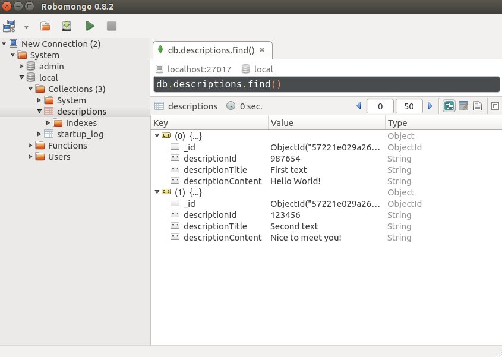

## FalcorJS tutorial

To start you need to have installed MongoDB on your computer. We will be using Robomongo GUI during this tutorial too.

First let's create our project directory called falcor-tutorial, then add data.js file:

```
mkdir falcor-tutorial
cd falcor-tutorial
touch data.js
```

Inside the data.js file we need to insert some data in JSON format:

```
[
    {
        id: "987654",
        title: "First text",
        content: "Hello World!"
    },
    {
        id: "123456",
        title: "Second text",
        content: "Nice to meet you!"
    }
]
```


We need to run MongoDB in background ( I am assuming that it has been already installed), just type in the terminal:

```
mongod
```

Then open Robomongo client.

Another step is to import our data object we created earlier to our MongoDB:

```
mongoimport --db local --collection descriptions --jsonArray data.js --host=127.0.0.1
```

After executing this command we can view through Robomongo that data was succesfully imported :



### Now let's do server setup with NodeJS and Express.js

First step is to initialze NPM project in our directory and create a server.js file in server directory:
```
npm init --yes

mkdir server
cd server
touch index.js
```

Then install all necessary dependencies:
```
npm i express@4.13.4 babel@4.7.16 babel-register@6.5.2 cors@2.7.1 body-parser@1.15.0 --save
```

