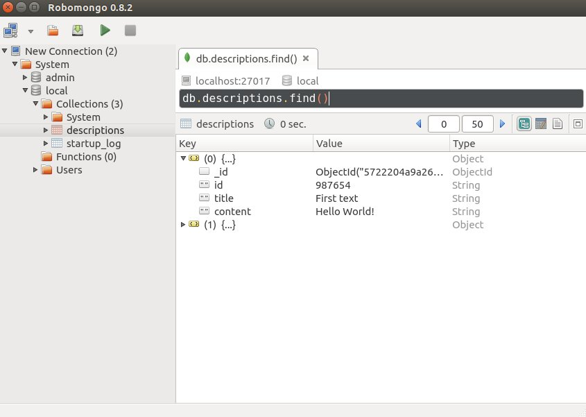
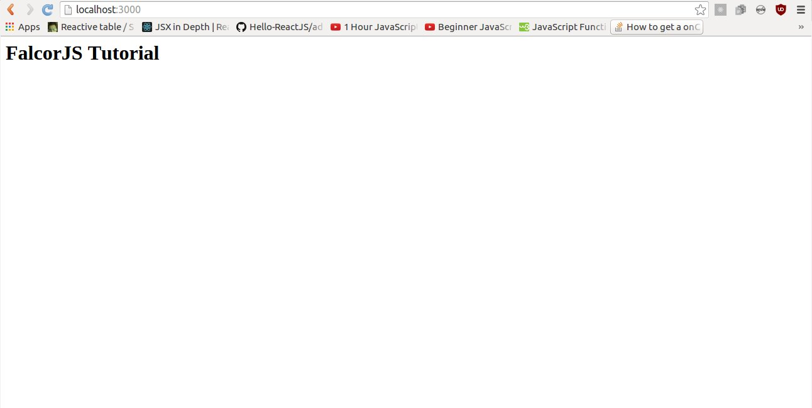
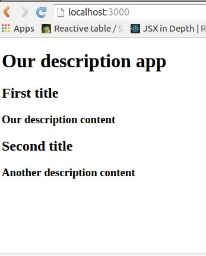
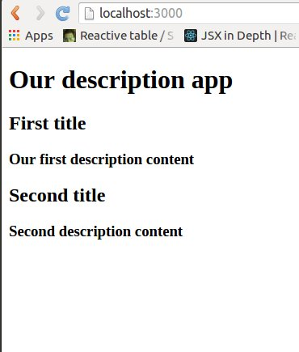
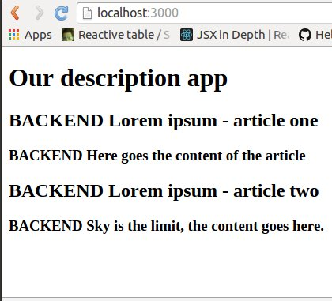

## FalcorJS tutorial

To start you need to have installed MongoDB on your computer. We will be using Robomongo GUI during this tutorial too.

First let's create our project directory called falcor-tutorial, then add data.js file:

```
mkdir falcor-tutorial
cd falcor-tutorial
touch data.js
```

Inside the data.js file we need to insert some data in JSON format:

```
[
    {
        id: "987654",
        title: "First text",
        content: "Hello World!"
    },
    {
        id: "123456",
        title: "Second text",
        content: "Nice to meet you!"
    }
]
```


We need to run MongoDB in background ( I am assuming that it has been already installed), just type in the terminal:

```
mongod
```

Then open Robomongo client.

Another step is to import our data object we created earlier to our MongoDB:

```
mongoimport --db local --collection descriptions --jsonArray data.js --host=127.0.0.1
```

After executing this command we can view through Robomongo that data was succesfully imported :



### Now let's do server setup with NodeJS and Express.js

First step is to initialze NPM project in our directory and create a server.js and index.js files in server directory:
```
npm init --yes

mkdir server
cd server
touch index.js
touch server.js
```

Then install all necessary dependencies:
```
npm i express@4.13.4 babel@4.7.16 babel-register@6.5.2 cors@2.7.1 body-parser@1.15.0 --save
```

The index.js file:
```
require("babel/register");
require('./server');
```


And the server.js file with simple string viewed on the app screen should look like this :
```
import http from 'http';
import express from 'express';
import cors from 'cors';
import bodyParser from 'body-parser';

var app = express();
app.server = http.createServer(app);

// CORS - 3rd party middleware
app.use(cors());

// This is required by falcor-express middleware to work correctly with falcor-browser
app.use(bodyParser.json({extended: false}));

app.get('/', (req, res) => res.send('FalcorJS Tutorial'));

app.server.listen(process.env.PORT || 3000);
console.log(`Started on port ${app.server.address().port}`);

export default app;

```
Next run this command in terminal:
```
node server/index.js 
```
After running this through node js, 'FalcorJS Tutorial' string that we are sending should show on the screen:



## Adding Redux

First let's create reducer for adding description.

```
mkdir src
cd src
mkdir reducers
cd reducers
touch BookDescriptionReducer.js
```

Our reducer will look like this:

```
const defaultDescriptions = {
	"987654": {
		descriptionTitle: "First title",
		descriptionContent: "Our description content"
	},
	"123456": {
		descriptionTitle: "Second title",
		descriptionContent: "Another description content"
	}
};

const descriptionReducer = (state = defaultDescriptions, action) => {
	switch (action.type) {
		case 'RETURN_ALL_DESCRIPTIONS':
			return Object.assign({}, state);
		default:
			return state;
	}
}

export default descriptionReducer
```

Later we will need webpack, so enter your main directory and create dist directory with index.html file inside:

```
mkdir dist
cd dist
touch index.html
```

Insert to index.html following code:

```
<!doctype html>
<html lang="en">
<head>
  <title>Tutorial App</title>
  <meta charset="utf-8">

</head>
<body>
  <div id="tutorial-app-root"></div>
  <script src="app.js"></script>
</body>
</html>
```

Install Webpack, React, Redux and other important dependencies (you may need sudo root's access for it):

```
npm i --save webpack@1.12.14 webpack-dev-server@1.14.1

npm i --save react@0.14.7 react-dom@0.14.7 react-redux@4.4.0 redux@3.3.1

npm i --save-dev babel-core@6.6.5 babel-polyfill@6.6.1 babel-loader@6.2.4 babel-preset-es2015@6.6.0 babel-preset-react@6.5.0 babel-preset-stage-0
```


...then in the main directory create file:
```
touch webpack.config.js
```

And enter webpack's configuration:
```
module.exports = {
    entry: ['babel-polyfill', './src/App.js'],
    output: {
        path: './dist',
        filename: 'app.js',
        publicPath: '/'
    },
    devServer: {
        inline: true,
        port: 3000,
        contentBase: './dist'
    },
    module: {
        loaders: [
            {
                test: /\.js$/,
                exclude: /(node_modules|bower_components)/,
                loader: 'babel',
                query: {
                    presets: ['es2015', 'stage-0', 'react']
                }
            }
        ]
    }
}
```
We also need to update our package.json file (add scripts):

```
  "scripts": {
    "dev": "webpack-dev-server"
  },
```

Next let's create App.js in src/App.js:

```
import React from 'react'
import { render } from 'react-dom'
import { Provider } from 'react-redux'
import { createStore } from 'redux'
import BookDescriptionReducer from './reducers/BookDescriptionReducer'
import BookDescriptionApp from './layouts/BookDescriptionApp'

let store = createStore(BookDescriptionReducer)

render(
    <Provider store={store}>
        <BookDescriptionApp />
    </Provider>,
    document.getElementById('tutorial-app-root')
);
```

Now we need to create the main view of our app in 'src' directory.

```
mkdir layouts
cd layouts
touch BookDescriptionApp.js
```

With following content:

```
import React from 'react';
import { connect } from 'react-redux';

const mapStateToProps = (state) => ({
  ...state
});

const mapDispatchToProps = (dispatch) => ({
});

class BookDescriptionApp extends React.Component {
  constructor(props) {
    super(props);
  }
  render () {
    console.log(this.props);    
    return (
      <div>
          Our description app
      </div>
    );
  }
}

export default connect(mapStateToProps, mapDispatchToProps)(BookDescriptionApp);
```

### Finishing our first static description app

We need to change the React's render function
as following (in src/views/DescriptionApp.js):
```
  render () {
    let descriptionsJSX = [];
    for(let descriptionKey in this.props) {
        let descriptionDetails = this.props[descriptionKey];
        let currentDescriptionJSX = (
            <div key={descriptionKey}>
                <h2>{descriptionDetails.descriptionTitle}</h2>
                <h3>{descriptionDetails.descriptionContent}</h3>
            </div>);
        descriptionsJSX.push(currentDescriptionJSX);
    }
    return (
      <div>
          <h1>Our description app</h1>
          {descriptionsJSX}
      </div>
    );
  }
```

This command will start your project on 3000 ports:
```
npm run dev
```

### Building app trough combining Falcor and Redux

We will start by installing Falcor from NPM.

```
npm i --save falcor@0.1.16 falcor-http-datasource@0.1.3
```

Let's create our app's Falcor model on the client-side:
```
cd src
touch falcorModel.js
```
```
const falcor = require('falcor');
const FalcorDataSource = require('falcor-http-datasource');

let cache = {

  descriptions: [
                  {
                    id: "987654",
                    descriptionTitle: "First text",
                    descriptionContent: "Hello World!"
                  },
                  {
                    id: "123456",
                    descriptionTitle: "Second text",
                    descriptionContent: "Nice to meet you!"
                  }
                ]
              };
const model = new falcor.Model({
  "cache": cache
});

export default model;
```

Next we will fetch data from frontend's Falcor's model in our BookDescriptionApp component, we will add a new function called _fetch() which will be responsible for fetching all descriptions on our application start.

BookDescriptionsApp.js:

```
import falcorModel from '../falcorModel.js';
```

And in our BookDescriptionsApp.js app we need to add two following functions componentWillMount() and _fetch() :

```
class BookDescriptionApp extends React.Component {
  constructor(props) {
    super(props);
  }

  componentWillMount() {
    this._fetch();
  }

  async _fetch() {
    let descriptionsLength = await falcorModel.
      getValue("descriptions.length").
      then(function(length) {  
        return length;
      });

    let descriptions = await falcorModel.
      get(['descriptions', {from: 0, to: descriptionsLength-1}, ['id','descriptionTitle', 'descriptionContent']]). 
      then(function(descriptionsResponse) {  
        return descriptionsResponse.json.descriptions;
      });
  }
 
```

In the end, we receive from Falcor an array of descriptions objects


Create actions directory with descriptions.js:
```
pwd
cd src
mkdir actions
cd actions
touch descriptions.js
```

And create the content for our src/actions/descriptions.js file as following:

```
export default {
  descriptionsList: (response) => {
    return {
      type: 'ADD_LIST_DESCRIPTION',
      payload: { response: response }
    }
  }
}
```

In the src/layouts/BookDescriptionApp.js file we need add in top of the file's a new import code:
```
import { bindActionCreators } from 'redux';
import descriptionActions from '../actions/descriptions.js';
```

Then modify our existing function in BookDescriptionApp.js:

```
const mapDispatchToProps = (dispatch) => ({
  descriptionActions: bindActionCreators(descriptionActions, dispatch)
});
```

Now, after you are done with this changes then add an action into our component in _fetch function: 

```
this.props.descriptionsList.descriptionsList(descriptions);
```

Let's improve our ***src/reducers/BookDescriptionReducer.js*** file:
```
const descriptionReducer = (state = {}, action) => {
  switch (action.type) {
    case 'RETURN_ALL_DESCRIPTIONS':
      return Object.assign({}, state);
    case 'ADD_LIST_DESCRIPTION':
      console.info("ADD_LIST_DESCRIPTION", action.payload.response);
      return Object.assign({}, action.payload.response);
    default:
      return state;
  }
}

export default descriptionReducer

```

If you will run http://localhost:3000/index.html then you should see:



### Moving Falcor's model to backend:

To do that we need to update our package.json file:

```
  "scripts": {
    "dev": "webpack-dev-server",
    "start": "npm run webpack; node server",
    "webpack": "webpack --config ./webpack.config.js"
  },
```

And next important thing is to install new dependencies that are required for Falcor's on the backend:

```
npm i --save falcor-express@0.1.2 falcor-router@0.3.0
```
Then edit the ***server/server.js*** as following:

1) On top of our file import new libraries in the ***server/server.js***:
```
import falcor from 'falcor';
import falcorExpress from 'falcor-express';
```


2) and then between the two:
- app.use(bodyParser.json({extended: false}));
- and app.use(express.static('dist'));

add a new code for managing Falcor's on the backend:
```

let cache = {
  descriptions: [
    {
        id: 987654,
        descriptionTitle: "First title",
        descriptionContent: "Our description content"
    },
    {
        id: 123456,
        descriptionTitle: "Second title",
        descriptionContent: "Another description content"
    }
  ]
};

var model = new falcor.Model({
  cache: cache
});

app.use('/model.json', falcorExpress.dataSourceRoute(function(req, res) {
    return model.asDataSource();
}));

```

The above code is almost the same as the one in the src/falcorModel.js file.

If you follow all the instructions correctly, then you can also make a request to your server directly from your browser by:

```
http://localhost:3000/model.json?paths=[["descriptions",{"from":0,"to":1},["descriptionContent","descriptionTitle","id"]]]&method=get
```

If you run your app with:
```
npm start
```

You will see:



### Configuring Falcor's router (ExpressJS)

Replace falcorModel code with this one:

```
const falcor = require('falcor');
const FalcorDataSource = require('falcor-http-datasource');
const $ref = falcor.Model.ref;
const $atom = falcor.Model.atom;


const model = new falcor.Model({
  source: new FalcorDataSource('/model.json')
});

export default model;
```

We need to create our routes definition file that will be consumed by falcor-router's lib:
```
$ cd server
$ touch routes.js
```

We have created the server/routes.js file, the content for that router will be as following:

```
let PublishingAppRoutes = [{
  route: 'descriptions.length',
  get: () => {
    let descriptionsCountInDB = 2; // hardcoded for example
    return {
      path: ['descriptions', 'length'],
      value: descriptionsCountInDB
    };
  }
}];

export default PublishingAppRoutes;
```

### Second route for returning our two descriptions from backend

Add this code, this new object as a second route in route.js:
```
{
  route: 'descriptions[{integers}]["id","descriptionTitle","descriptionContent"]',
  get: (pathSet) => {
    let descriptionsIndex = pathSet[1];
    let descriptionsArrayFromDB = [{
      "descriptionId": "987654",
      "descriptionTitle": "BACKEND Lorem ipsum - description one",
      "descriptionContent": "BACKEND Here goes the content of the description"
    }, {
      "descriptionId": "123456",
      "descriptionTitle": "BACKEND Lorem ipsum - description two",
      "descriptionContent": "BACKEND Sky is the limit, the content goes here."
    }]; // That are our mocked descriptions from MongoDB

    let results = [];
    descriptionsIndex.forEach((index) => {
      let singleDescriptionObject = descriptionsArrayFromDB[index];
      let falcorSingleArticleResult = {
        path: ['articles', index],
        value: singleDescriptionObject
      };
      results.push(falcorSingleDescriptionResult);
    });

    return results;
  }
}
```

### Last thing to make full-stack's Falcor example run

Currently, we still have a mocked data in our routes, but before we will start making calls to MongoDB we need to wrap-up the current setup, so you will be able to see it running in your browser.

Open your server/server.js and make sure you import those two things:
```
import Router from 'falcor-router';
import routes from './routes.js';
```

OK, so we have imported our falcor-router and routes.js - now we need to use them, so modify this old code:
```
// THIS IS OLD CODE, remove it and replace with new
app.use('/model.json', falcorExpress.dataSourceRoute(function(req, res) {
    return model.asDataSource();
}));
```

the above replace into new code as following:

```
app.use('/model.json', falcorExpress.dataSourceRoute(function(req, res) {
 return new Router(routes);
}));
```

If you followed the instructions correctly, you will be able to run the project:
```
npm start
```

and on ports 3000 you will see:



### Adding MongoDB/Mongoose calls based on Falcor's routes

We need to move over (delete from server.js and move into routes.js) this code:
```
// this goes to server/routes.js
import mongoose from 'mongoose';

mongoose.connect('mongodb://localhost/local');

var descriptionSchema = {
  descriptionTitle:String,
  descriptionContent:String
}

var FalcorDescription = mongoose.model('FalcorDescription', descriptionSchema, 'descriptions');
```


... and in first ***route descriptions.length*** you need to replace the mocked number two (descriptions count) into Mongoose's count method:
```
  route: 'descriptions.length',
    get: () => {
    return FalcorDescription.count({}, function(err, count) {
      return count;
    }).then ((descriptionsCountInDB) => {
      return {
        path: ['descriptions', 'length'],
        value: descriptionsCountInDB
      }
    })
  }
```

The method ***FalcorDescription.count*** simply retrieves the integer number of descriptions count from our ***Description model*** (that was prepared in the beggining).


The second route ***route: 'descriptions[{integers}]["id","descriptionTitle","descriptionContent"]',*** has to be changed as following:

```
{
  route: 'descriptions[{integers}]["id","descriptionTitle","descriptionContent"]',
  get: (pathSet) => {
    let descriptionIndex = pathSet[1];

    return FalcorDescription.find({}, function(err, descriptionsDocs) {
      return descriptionsDocs;
    }).then ((descriptionsArrayFormDB) => {
      let results = [];
      descriptionIndex.forEach((index) => {
        let singleDescriptionObject = descriptionsArrayFormDB[index].toObject();
        let falcorSingleDescriptionResult = {
          path: ['articles', index],
          value: singleDescriptionObject
        };
        results.push(falcorSingleDescriptionResult);
      });
      console.info(">>>> results", results);
      return results;
    })
  }
}
```
We return a promise again with ***FalcorDescription.find***. Also we have deleted mocked response from database and instead of that we are using ***FalcorDescription.find*** method.

The array of descriptions is returned in ***}).then ((descriptionsArrayFormDB) => {*** where next we simply iterate and create a results' array.

Please note that on ***let singleDescriptionObject = descriptionsArrayFormDB[index].toObject();*** we use a method ***.toObject***. This is very important to make this work.


### First working full-stack app
After that you shall have complete full-stack version of the app working:


### New MongoDB's users collection

We need create a users collection in our database. The users will have privilages to:
1) Add new descriptions in our publishing application
2) Edit existing descriptions in our publishing application
3) Delete descriptions in our publishing application.

```
$ cd ..]
$ touch initPubUsers.js
```

then add the content following content to the initPubUsers.js:

```
[
  {
    "username" : "admin",
    "password" : "151c1d587c056c961cefba4d825a0e773ddaaa0b2205935ece4358d00d4be63c",
    "firstName" : "Michal",
    "lastName" : "Sawicki",
    "email" : "michal@mobilewebpro.pl",
    "role" : "admin",
    "verified" : false,
    "imageUrl" : "https://upload.wikimedia.org/wikipedia/commons/thumb/a/a4/Aristoteles_Louvre.jpg/180px-Aristoteles_Louvre.jpg"
  }
]
```

Password : "151c1d587c056c961cefba4d825a0e773ddaaa0b2205935ece4358d00d4be63c" created by visiting - http://www.xorbin.com/tools/sha256-hash-calculator - and typing "123456descApp" calculated to SHA256 hash.

These steps are required only on the beginning, later we need to program a registration form that is salting the password for our own.

##### Importing the initPubUsers.js file into MongoDB
We can now run a command line as following in order to import that new pubUsers collection to our database:
```
mongoimport --db local --collection pubUsers --jsonArray initPubUsers.js --host=127.0.0.1
```

#### Working on the login's falcor-route

Now we need to start working with the falcor-router in order to create a new endpoint that will use the jwt library to provide a unique tokens for the client-side app.

The first thing that we need to do is to provide a "secret" on the backend.

```
$ cd server
$ touch configSecret.js

export default {
  'secret': process.env.JWT_SECRET || 'devSecretGoesHere'
}
```

#### Creating a falcor-router's login (backend)

In order to make our codebase more organized, instead of adding one more route to our ***server/routes.js*** file, we will make a new file called ***routesSession.js*** and in that file we will keep all endpoints related to the current logged user's session:

First open the server.js file on order to add one line of code that will allow to post usernames and passwords to the backend, so add this:
```
app.use(bodyParser.urlencoded({extended: false}));
```
... this has to be added under ***app.use(bodyParser.json({extended: false}));***

Then create a new file in the server directory:
```
$ touch routesSession.js
```

And put this initial content into the ***routesSession.js*** file:

```
export default [
  { 
    route: ['login'] ,
    call: (callPath, args) => 
      {
        let { username, password } = args[0];

        let userStatementQuery = {
          $and: [
              { 'username': username },
              { 'password': password }
          ]
        }
      }
  }
];
```

The difference between call and get method in falcor's routes is that we can provide arguments with ***args***. That allows us to get from the client-side the username and the password. 

The plan is that after we receive credentials with this:
```
let { username, password } = args[0];
```

then we will check them against our database with one user admin. A user will need to know that the real plaintext password is ***123456*** in order to get a correct login jwt token.

#### Separating the DB configs - configMongoose.js

```
$ touch configMongoose.js
```

and it's new content:
```
import mongoose from 'mongoose';

const conf = {
  hostname: process.env.MONGO_HOSTNAME || 'localhost',
  port: process.env.MONGO_PORT || 27017,
  env: process.env.MONGO_ENV || 'local',
};

mongoose.connect(`mongodb://${conf.hostname}:${conf.port}/${conf.env}`);

var descriptionSchema = {
  descriptionTitle:String,
  descriptionContent:String
}

var FalcorDescription = mongoose.model('FalcorDescription', articleSchema, 'descriptions');

export default {
  FalcorDescription
}
```

#### Rewriting the routes.js file
After we have two new files: configMongoose.js and routesSession.js then we have to rewrite our ***server/routes.js*** file in order to make everything work together.


First step, delete from routes.js the following code:
```
import mongoose from 'mongoose';

mongoose.connect('mongodb://localhost/local');

var descriptionSchema = {
  descriptionTitle:String,
  descriptionContent:String
}

var FalcorDescription = mongoose.model('FalcorDescription', descriptionSchema, 'descriptions');
```

and replace it with new:
```
import { FalcorDescription } from './configMongoose';
import sessionRoutes from './routesSession';
```

also we need to spread the sessionRoutes into our current PublishingAppRoutes as following:
```
let PublishingAppRoutes = [
    ...sessionRoutes,
  {
  route: 'descriptions.length',
```
At the beginning of PublishingAppRoutes you need to spread ***...sessionRoutes,*** routes, so the login route will be available to use accross the Falcor's routes.

#### Double-check if app works, before implementing JWT

#### Creating a Mongoose users' model

In the file ***configMongoose.js*** we need to create and export a User model. Please add following code to that file:
```
var userSchema = {
  "username" : String,
  "password" : String,
  "firstName" : String,
  "lastName" : String,
  "email" : String,
  "role" : String,
  "verified" : Boolean,
  "imageUrl" : String
}

var User = mongoose.model('User', userSchema, 'pubUsers');


export default {
  Article,
  User
}
```

#### Implementing JWT in the routesSession.js file

First step is to export our User's model into the routesSession's scope by adding at the top of that file an import statement:
```
import { User } from './configMongoose';
````

Installing the jsonwebtoken & crypto (for SHA256):
```
$ npm i --save jsonwebtoken crypto
```

After you have installed jsonwebtoken, the we need to import it to the ***routesSession.js***:
```
import jwt from 'jsonwebtoken';
import crypto from 'crypto';
import jwtSecret from './configSecret';
```

After you have imported everything in the routesSession, then let's
continue on working with the ***route: ['login']***.

Below you need to improve the userStatementQuery, so it will have the saltedPassword instead of plain text:
```
let saltedPassword = password+"pubApp"; // pubApp is our salt string
let saltedPassHash = crypto.createHash('sha256').update(saltedPassword).digest('hex');
let userStatementQuery = {
  $and: [
      { 'username': username },
      { 'password': saltedPassHash }
  ]
}
``` 
... so instead of plain text, then we will query a salted SHA256 password.

... under this ***userStatementQuery*** please return a Promise, with following details:
```
        return User.find(userStatementQuery, function(err, user) {
          if (err) throw err;
        }).then((result) => {
          if(result.length) {
            return null; // SUCCESSFUL LOGIN mocked now (will implement next)
          } else {
            // INVALID LOGIN
            return [
              {
                path: ['login', 'token'], 
                value: "INVALID"
              },
              {
                path: ['login', 'error'], 
                value: "NO USER FOUND, incorrect login information" 
              }
            ];
          }
          return result;
        });
```

As you will learn later, we will ask for that token's path on the front-end.

#### Successful login on falcor-route

We need to improve successful login path. We have a case for handling an invalid login, we need to make a case that will handle a successful login, so please replace this code:
```
return null; // SUCCESSFUL LOGIN mocked now (will implement next)
```

with this code that is returning successful login's details:
```
let role = result[0].role;
let userDetailsToHash = username+role;
let token = jwt.sign(userDetailsToHash, jwtSecret.secret);
return [
  {
    path: ['login', 'token'],
    value: token
  },
  {
    path: ['login', 'username'],
    value: username
  },
  {
    path: ['login', 'role'],
    value: role
  },
  {
    path: ['login', 'error'],
    value: false
  }
];
```

#### Explanation:
As you can see, the only thing that we fetch from DB right now is the role value === ***result[0].role***. We need add this to hash, because we don't want our app to be vulnerable so a normal user can get an admin role with some hacking. The value of the ***token*** is calculated based on ***userDetailsToHash = username+role*** - that's enough for now.

After we are fine here the only thing that needs to be done on the backend is returning the paths with values:
1) The login token with: ['login', 'token']
2) The username with ['login', 'username']
3) The logged user's role with: ['login', 'role']
4) ... and an information that there were no errors' at all with: ['login', 'error']

The next step is to use this route on the Front-end.

Please run the app and then if everything is working for you, and after it works for you then let's to start the front-end codings' fun right now!


### Front-end side and Falcor

Let's create a new route for login in our redux application. In order to do that, we need to introduce the ***react-router***:
```
$ npm i --save react-router@1.0.0 redux-simple-router@0.0.10 redux-thunk@1.0.0
```

PLEASE NOTE: it's important to use correct NPM's versions

After we have installed them, we need to add routes in the src:
```
$ cd src
$ mkdir routes
$ touch index.js
```

then make the content of this index.js file as following:
```
import React                        from 'react';
import { Route, IndexRoute }        from 'react-router';

/* wrappers */
import CoreLayout                   from '../layouts/CoreLayout';

/* home view */
import PublishingApp                    from '../layouts/PublishingApp';

/* auth views */
import LoginView                    from '../views/LoginView';

export default (
  <Route component={CoreLayout} path='/'>
    <IndexRoute component={PublishingApp} name='home' />
    <Route component={LoginView} path='login' name='login' />
  </Route>
);
```

At this points we are missing two components for our app called CoreLayout & LoginView (we will implement them in a minute).

#### CoreLayout's component

Create it by doing as following:
```
cd ../layouts/
touch CoreLayout.js
```

... and then populate it with the following content:
```
import React from 'react';
import { Link } from 'react-router';

class CoreLayout extends React.Component {
  static propTypes = {
    children : React.PropTypes.element
  }

  constructor(props) {
    super(props);

  }

  render () {
    return (
      <div>
        <span>Links: <Link to='/login'>Login</Link> | <Link to='/'>Home Page</Link></span>
          <br/>
          {this.props.children}
      </div>
    );
  }
}

export default CoreLayout;
```
As you probably know, the all content of a current route will go into the ***{this.props.children}***'s target (that is basic's React.JS concept you must to know beforehand). We also created two links to our routes as a header.


#### LoginView's component

For the time being, we will create a mocked LoginView as you can find below with the "FORM GOES HERE"'s placeholder:
```
"use strict";

import React from 'react';
import Falcor from 'falcor';
import falcorModel from '../falcorModel.js';
import { connect } from 'react-redux';
import { bindActionCreators } from 'redux';

const mapStateToProps = (state) => ({
  ...state
});

const mapDispatchToProps = (dispatch) => ({

});

class LoginView extends React.Component {
  constructor(props) {
    super(props);
  }

  render () {
    return (
      <div>
          <h1>Login view</h1>
          FORM GOES HERE
      </div>
    );
  }
}

export default connect(mapStateToProps, mapDispatchToProps)(LoginView);
```

We are done with all missing pieces for the ***routes/index.js***, but there some other outstanding stuff to do before our app with the routing will be working.

#### A ROOT's container for our app

```
$ pwd 
$ [[[you shall be at the src folder]]]
$ mkdir containers
$ cd container
$ touch Root.js
```

The Root.js is going to be our main root file - the content of this file is as following:
```
import React                    from 'react';
import { Provider }             from 'react-redux';
import { Router }               from 'react-router';
import routes                   from '../routes';
import createHashHistory        from 'history/lib/createHashHistory';

let noQueryKeyHistory = createHashHistory({
  queryKey: false
});

export default class Root extends React.Component {
  static propTypes = {
    history : React.PropTypes.object.isRequired,
    store   : React.PropTypes.object.isRequired
  }

  render () {
    return (
      <Provider store={this.props.store}>
        <div>
          <Router history={noQueryKeyHistory}>
            {routes}
          </Router>
          
        </div>
      </Provider>
    );
  }
}
```

#### Remaining configuration for: configureStore & rootReducer

Let's create an index.js file in our reducers directory:
```
$ pwd 
$ [[[you should be at the src folder]]]
$ cd reducers
$ touch index.js
```

... and the content for the index.js is as following:
```
import { combineReducers }    from 'redux';
import { routeReducer }       from 'redux-simple-router';

import descriptionReducer  from './BookDescriptionReducer.js';

export default combineReducers({
  routing: routeReducer,
  descriptionReducer
});
```

```
$ pwd 
$ [[[you should be at the src folder]]]
$ mkdir store
$ cd store
$ touch configureStore.js
```

... and the content for the configureStore.js:
```
import rootReducer          from '../reducers';
import thunk                from 'redux-thunk';
import {
  applyMiddleware,
  compose,
  createStore
} from 'redux';

export default function configureStore (initialState, debug = false) {
  let createStoreWithMiddleware;

  const middleware = applyMiddleware(thunk);

  createStoreWithMiddleware = compose(middleware);

  const store = createStoreWithMiddleware(createStore)(
    rootReducer, initialState
  );
  return store;
}
```
In the above's code we are importing the rootReducer that we've created recently. We also import the redux-thunk's lib which is very useful for server side rendering (described later in the book). 

At the end, we export a store which is composed of many different's reducers (currently routing and article's reducer that you can find in ***reducer/index.js***) and is able to handle the server rendering initial's state.

#### Last tweaks in layouts/PublishingApp.js before running the app

The last thing that changed in our app is that we have out-of-date code in PublishingApp.

Why outdated? Because we have introduced rootReducer and combineReducers so if you will check your code in render of PublishingApp here:
```
   let descriptionsJSX = [];
    for(let descriptionKey in this.props) {
        let descriptionDetails = this.props[descriptionKey];
        let currentDescriptionJSX = (
            <div key={descriptionKey}>
                <h2>{descriptionDetails.descriptionTitle}</h2>
                <h3>{descriptionDetails.descriptionContent}</h3>
            </div>);
        descriptionsJSX.push(currentDescriptionJSX);
    }
```

... then it won't work, because you are you need to change it to this:
```
    let descriptionsJSX = [];
    for(let descriptionKey in this.props.descriptionReducer) {
        let descriptionDetails = this.props.descriptionReducer[descriptionKey];
        let currentDescriptionJSX = (
            <div key={descriptionKey}>
                <h2>{descriptionDetails.descriptionTitle}</h2>
                <h3>{descriptionDetails.descriptionContent}</h3>
            </div>);
        descriptionsJSX.push(currentDescriptionJSX);
    }
```
#### Last changes in src/app.js before running the app

Last thing is to improve the src/app.js so it will use the Root's container. We need to change the old code:

```
import React from 'react'
import { render } from 'react-dom'
import { Provider } from 'react-redux'
import { createStore } from 'redux'
import descriptionReducer from './reducers/BookDescriptionReducer'
import BookDescriptionApp from './layouts/BookDescriptionApp'


let store = createStore(descriptionReducer);

render(
   <Provider store={store}>
       <BookDescriptionApp />
   </Provider>,
   document.getElementById('tutorial-app-root')
);
```

... the above's code we need to change to the below's one:

```
import React                  from 'react';
import ReactDOM               from 'react-dom';
import createBrowserHistory   from 'history/lib/createBrowserHistory';
import { syncReduxAndRouter } from 'redux-simple-router';
import Root                   from './containers/Root';
import configureStore         from './store/configureStore';

const target  = document.getElementById('tutorial-app-root');
const history = createBrowserHistory();

export const store = configureStore(window.__INITIAL_STATE__);

syncReduxAndRouter(history, store);

const node = (
  <Root
    history={history}
    store={store}
  />
);

ReactDOM.render(node, target);
```

### Working on the login form that will call the backend in order to authenticate.

For making our work easier with forms, we will start using a ***formsy-react***'s library. Let's install them:
```
$ npm i --save material-ui@0.15.0-alpha.2 formsy-react@0.17.0
```

#### Working on LoginForm and DefaultInput components

```
$ mkdir src/components
$ cd components
$ touch DefaultInput.js
```

and then please make a content of this file as following:
```
import React from 'react';
import {TextField} from 'material-ui';
import {HOC} from 'formsy-react';

class DefaultInput extends React.Component {
  constructor(props) {
    super(props);
    this.changeValue = this.changeValue.bind(this);
    this.state = { currentText: null }
  }

  changeValue(e) {
    this.setState({currentText: e.target.value})
    this.props.setValue(e.target.value);
    this.props.onChange(e);
  }

  render() {
    return (<div>
        <TextField 
          ref={this.props.name}
          floatingLabelText={this.props.title}
          name={this.props.name}
          onChange={this.changeValue}
          required={this.props.required}
          type={this.props.type}
          value={this.state.currentText ? this.state.currentText : this.props.value}
          defaultValue={this.props.defaultValue} />
        {this.props.children}
      </div>);
  }
};
export default HOC(DefaultInput);
```